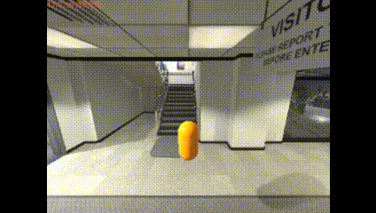

# tesse-core

__TESSE__ is an open-source Unity plugin that enables users to develop robotic, computer vision and reinforcement learning technologies. 
The large amount of data often required for these applications makes real-world data collection difficult; 
as an alternative, this simulation framework allows researchers and practitioners to generate large datasets in varied environments to develop these technologies. 

The core features of __TESSE__ include the following.
- A robot *agent* is core to the __TESSE__ plugin. We currently provide a *pill* robot, with more robots to come. 
- There is access to multiple agent cameras: red-green-blue (RGB), depth, and semantic segmentation.
- There is access to physics information for the agent (e.g., position, velocity, collisions).
- A user can configure various aspects of the agent, such as camera locations, image sizes, and toggling collisions.
- There are various control paradigms for the agent.
- There are various time paradigms, as well.
- Network interfaces are available to send data back and forth between Unity. The [tesse-interface](../../../tesse-interface) provides a python package that uses the network interface. This package is compatible with multiple versions of python and has minimal dependencies.

The capabilities of __TESSE__ encompass many aspects of similar systems used for robotics and reinforcement learning in a single framework. 
However, existing systems often require multiple packages and a large amount of software integration to deliver the same set of functionality. 
With __TESSE__, we strive to have few software dependencies and provide a flexible interface so that we support a wide range of use cases without enforcing a stringent workflow.

__Table of Contents__
1. [Getting Started](#getting-started)
2. [Capabilities](#capabilities)
3. [Operation](#operation)
4. [Conventions](#conventions)
5. [Disclaimer](#disclaimer)


## Getting Started

Most users just need a Unity build that includes __TESSE__ and some way to send data back and forth between Unity and their own algorithms/software. 
Others may want to develop their own Unity environment with __TESSE__ in order to use their own environments, for example.

### Basic Users

For most users, the simplest thing to do is:
1. Obtain a Unity build with __TESSE__ from the authors.
2. Obtain [tesse-interface](../../../tesse-interface), which provides a Python package to interact with the Unity build. Follow instructions there for using it.

### Unity Developers

This repository contains the core components of the __TESSE__ simulation including materials, interfaces and agents.
It is meant to be included into a full Unity project that contains build settings, scenes, third party asset packages, custom assets, etc.
Unity 2019.1 or newer are required.

This repository should be included in your Unity project's `Assets` folder.
- For non-version controlled projects, navigate to `[Unity Project]/Assets` and clone this repository: `git clone git@github.mit.edu:TESS/tesse-core.git`.
- For version controlled projects, add this repository as a submodule to your git project:
```
cd [Unity Project]/Assets
git submodule add git@github.mit.edu:TESS/TESSE_core.git TESSE
```

For an example of how this repository integrates into a full simulation build, see [tesse-example-project](../../../tesse-example-project).

__Scenes__

The __TESSE__ agent exists in a dedicated scene called [tesse_multiscene](Scenes/tesse_multiscene.unity).
This scene acts as the entry point to the simulation and __TESSE__ [additively loads](https://docs.unity3d.com/ScriptReference/SceneManagement.LoadSceneMode.Additive.html) other scenes.
This permits Unity builds to contain multiple scenes that can be switched between.

In order to add the __TESSE__ agent to your scene, follow these steps:
1. Add [tesse_multiscene](Scenes/tesse_multiscene.unity) scene to the build settings. 
2. Next, add the desired scene (or scenes) to the build settings ensuring that all added scenes are **below** the *tesse_multiscene* scene in the build order. 
Note that __TESSE__ expects [tesse_multiscene](Scenes/tesse_multiscene.unity) to be at index 0 in the build order.
3. Toggle the check mark in the build settings to specify which scenes you want added to your Unity build.

An overview video of this process is described [here](https://youtu.be/MQKJfZCAEa8?t=102).

## Capabilities

### Data

A user can obtain images for multiple sensor modalities: red-green-blue, depth, and semantic segmentation (see figure).


### Dynamics and Control

A user can select from two modes of agent control:
- __Continuous__: This mode of control uses the Unity physics engine to simulate the agent kinematics based on the control inputs from the keyboard or network interface.
- __Discrete__: This mode of control moves the agent by discrete steps in position and orientation. 
It is only available through the network interface.

 

### Timing Modes

Time in __TESSE__ (or Unity) can progress according to two modes of operation.

- __Standard__: In this mode, game time progresses in real-time.
- __Step__: In this mode, game time moves forward a fixed amount of time after a movement command is received by the agent. 
The use can set the amount of time that elapses for each step.

### Semantic Segmentation

A user can control semantic labels for each texture in a scene. 

Each scene has an associated csv-file with labelling information at `[Unity Project]/Assets/StreamingAssets/[Scene Name]_segmentation_mapping.csv`. 
If this file does not exist when a new scene is loaded, then __TESSE__ will create it and randomly assign colors to each texture. 
The columns in order are texture name, red value, blue value, green value, and alpha value. 
An example start of the file looks like the following.
```
Chair_Spinning,69,18,25,255
Box_Black,153,57,157,255
Pencil,125,23,151,255
Pen,165,125,227,255
Mug_WithPens,21,239,196,255
...
```

As a user, you can change the red, blue, green, and alpha (RGBA) values. 
One use case would be to assign all wall textures to the same RGBA values. 
Alternatively, a user could re-purpose the red value to represent a *label id* (e.g., all walls are 0, floors are 1, tables are 2).

### Agent Spawn Points

Typically, randomly spawning the agent will place the agent near a location specified in a json at `[Unity Project]/Assets/StreamingAssets/[Scene Name].points`. 
This json object corresponds to a serialization of `ListOfSpawnPoints`, which is defined in [tesse_spawn_manager.cs](scripts/tesse_spawn_manager.cs#L45). An example file looks like the following.
```
{
    "spawnPoints": [
        {
            "name": "tesse_multiscene_agent",
            "points": [{"x": -2.4, "y": 0.5, "z": -0.1}, {"x": -1, "y": 0.5, "z": -0.2}]
        },
        {
            "name": "tesse_cube_gold",
            "points": [{"x": -1, "y": 0.5, "z": -3}, {"x": -3, "y": 0.5, "z": -4}]
        },
        {
            "name": "tesse_cube_black",
            "points": [{"x": -2, "y": 0.5, "z": -4}, {"x": -3, "y": 0.5, "z": 1}]
        }
    ]
}
```
This file specifies two spawn points for the agent, as well as two objects (`tesse_cube_gold` and `tesse_cube_black`) that the user can spawn into the scene (see #object-spawning).

Note that if this file does not exist, then __TESSE__ will randomly attempt to spawn the agent. 
This may cause the agent to be spawned into weird locations, such as the top of buildings.

Lastly, __TESSE__ can be put into a mode to generate this spawn file (see [Keyboard Controls](#keyboard-controls)). 
In this mode, you can move the agent through the environment and collect spawn points using the following keys:
- Use <kbd>i</kbd> to store the current point for the agent.
- Use <kbd>o</kbd> to continuously store points once per second for the agent.
- Use <kbd>p</kbd> to write all points to the spawn file.
- Use <kbd>k</kbd> to delete the previous point for the agent.
- Use <kbd>l</kbd> to delete all points for the agent.
- Use <kbd>;</kbd> to load the points from the spawn file on disk.

### Object Spawning

A build with __TESSE__ typically includes a list of objects that can be spawned by the user via a network interface as described below. Objects position and orientation can be specified by the user or randomly generated by the Unity build.

## Operation
 
__TESSE__ was primarily designed to provide a network interface. However, a limited set of command line arguments and keyboard controls are also available.

### Command Line Arguments

Some configuration of __TESSE__ is available via a command line interface. 
If the name of your Unity build is `tesse.x86_64`, for example, then the list of available arguments are as follows.
```
./tesse.x86_64 [--listen_port <list_port>] [--send_port <send_port> [--set_resolution <width> <height>] [--fullscreen] [--speed <speed>] [--turn_speed <turn_speed>] [--capture_rate <capture_rate>]
```

- __<listen_port>__ specifies the first port that __TESSE__ binds to to listen for external commands. 
The default value is 9000 and __TESSE__ will bind to multiple ports: `<listen_port>`, `<listen_port>+1`, `<listen_port>+2`, `<listen_port>+3`, and `<listen_port>+5`. 
Note that `<listen_port>+4` is reserved for future expansion. 
All ports operate on the UDP protocol.
- __<send_port>__ specifies the first port that __TESSE__ will use for sending data to clients using the TCP protocol.
Again, the default value is 9000 and __TESSE__ will use multiple ports: `<send_port>`, `<send_port>+1`, `<send_port>+2`, and `<send_port>+4`.  
`<send_port>+3` is reserved for future expansion. 
- __\<width\> and \<height\>__ set the screen resolution of the game. 
Default values are 1024 for `<width>` and 768 for `<height>`.
- __--fullscreen__ toggles Unity to display the game on your full screen. 
By default, Unity is run in a window.
- __\<speed\>__ sets the magnitude of the force when using keyboard controls. 
Default value is 2.
- __<turn_speed>__ sets the magnitude of the torque when using keyboard controls. 
Default value is 0.05.
- __<capture_rate>__ sets [Time.captureFramerate](https://docs.unity3d.com/ScriptReference/Time-captureFramerate.html) in Unity.
Default value is 0. 
Note this parameter may be useful when attempting to obtain images at a simulated frame rate higher than your hardware is capable of achieving.


### Keyboard Controls

The following keys can be used to move the agent.
- Use <kbd>w</kbd> and <kbd>s</kbd> to move forward and backward.
- Use <kbd>a</kbd> and <kbd>d</kbd> to *turn* left and right.
- Use <kbd>q</kbd> and <kbd>e</kbd> to *strafe* left and right.
- Use <kbd>x</kbd> to stop the agent in place.
- Use <kbd>r</kbd> to randomly respawn the agent in the current scene.

There are a few special key bindings, as well.
- Press <kbd>esc</kbd> to exit the application.
- Use left <kbd>shift</kbd> + <kbd>t</kbd> to toggle keyboard controls on and off.
- Use left <kbd>shift</kbd> + left <kbd>control</kbd> + <kbd>g</kbd> to enter spawn point capture mode. See [Agent Spawn Points](#agent-spawn-points) for a description of this mode.

### Network Interface

See [tesse-interface](../tesse-interface) for an example on how to use the network interface. 
In particular, there is a [python notebook](../tesse-interface/blob/master/python-demonstration.ipynb) with various examples.

### Running TESSE Headless

Use the following instructions to run __TESSE__ on a headless Linux server. This setup procedure has been tested on Ubuntu and Red Hat systems and is derived from [here](https://medium.com/@h0lycattle/running-unity3d-in-a-virtualized-headless-ubuntu-environment-1adf95c05994) and [here](https://github.com/mit-fast/FlightGoggles/wiki/Running-Flightgoggles-in-AWS).

1. Install Xorg:

    - Ubuntu:
     `sudo apt-get install xserver-xorg-core`
     
    - Red Hat:
     `sudo yum install xorg-x11-apps`
     
2. Get the BusID of the GPU:

    ` nvidia-xconfig --query-gpu-info`

    The BusID will look something like `PCI BusID : PCI:6:0:0`. If you have multiple GPUs on your system, pick the one you'd like serving as Unity's display device. 

3. Configure Xorg:

    `sudo nvidia-xconfig -a --allow-empty-initial-configuration --virtual=3200x1800 --busid BUS_ID `

    With `BUS_ID` being the value found above. Ensure that the file `/etc/X11/xorg.conf` has been created or edited. 

    Reboot after this step.

4. Finally, run the commands:

    ```sh
    export DISPLAY=:0
    sudo X :0 &
    ```

    `export DISPLAY=:0` must be run for every new shell session. `sudo X :0 &` must be run after a reboot.

#### Troubleshooting 
* If you're getting errors related to `ALSA lib`, install `pulseaudio`.
    - Ubuntu:
    `sudo apt-get install pulseaudio`
    - Red Hat:
    `sudo yum install pulseaudio`

## Conventions

__TESSE__ uses the following conventions.

### Coordinate System

Unity uses a left-handed coordinate system (see [Unity documentation](https://docs.unity3d.com/560/Documentation/Manual/Transforms.html)). 
For world coordinates, x- and z-axes are aligned with the horizontal plane, and the y-axis is aligned with up. 
For body coordinates, the z-axis is aligned with forward, the x-axis is positive to the right, and the y-axis is positive up.


Note that many popular robotics systems use right-handed coordinate systems, like [ROS](https://www.ros.org/reps/rep-0103.html#coordinate-frame-conventions).
Be careful if using __TESSE__ with other projects.

### Lengths and Gravity

Unity does not specify units for length.
However, most develops assume 1 unit corresponds to 1 meter by convention . 
We use this convention with __TESSE__.

In addition, the acceleration due to gravity is 9.8 m/s^2.


## Disclaimer

Distribution authorized to U.S. Government agencies and their contractors. Other requests for this document shall be referred to the MIT Lincoln Laboratory Technology Office.

This material is based upon work supported by the Under Secretary of Defense for Research and Engineering under Air Force Contract No. FA8702-15-D-0001. Any opinions, findings, conclusions or recommendations expressed in this material are those of the author(s) and do not necessarily reflect the views of the Under Secretary of Defense for Research and Engineering.

© 2019 Massachusetts Institute of Technology.

The software/firmware is provided to you on an As-Is basis

Delivered to the U.S. Government with Unlimited Rights, as defined in DFARS Part 252.227-7013 or 7014 (Feb 2014). Notwithstanding any copyright notice, U.S. Government rights in this work are defined by DFARS 252.227-7013 or DFARS 252.227-7014 as detailed above. Use of this work other than as specifically authorized by the U.S. Government may violate any copyrights that exist in this work.
